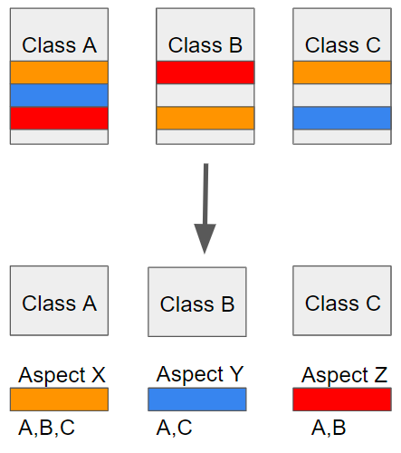

# 우아한 테크 캠프 TIL - 2023.08.10 (목)

## 스프링 AOP (1)

### 서문
이틀간 스프링 트랜잭션에 대해 공부하였다. 스프링 공식 문서에 따르면, 스프링 트랜잭션은 `AOP` 기술을 기반으로 동작한다고 한다.
따라서 이번에는 스프링 `AOP` 기술에 대해 알아보고자 한다

### 스프링 AOP 용어 정리



**Aspect**
- 다양한 클래스에서 공통적으로 등장하는 모듈화된 관심사이다
  - AOP 의 취지가 클래스 내에 흩어진 이러한 관심사 (Crosscutting Concern) 들을 하나로 모듈화 하는 것 !
- 대표적인 예시로는 자바 트랜잭션 관리가 있다

**Join point**
- 메서드 실행이나 예외처리와 같은 프로그램 실행 지점이다
- 스프링 AOP 에서 join point 는 항상 메서드 실행을 의미한다

**Advice**
- 특정 조인 포인트에서 `aspect` 에 의해 실행되는 행동이다
- `advice` 타입에는 `around`, `before`, `after` 등이 있다
- 스프링을 포함한 대부분의 AOP 프레임워크에서는 `advice` 를 인터셉터로 설계하고, `Join point` 마다 실행되는 `advice` 들의 체인을 유지한다

**Target object**
- 한 개 이상의 `Aspect` 의해 `Advice` 가 실행될 객체를 의미한다
- 스프링 `AOP` 가 런타임 프록시를 사용하여 구현되기 때문에, target object 는 항상 프록시 객체이다

**Aop proxy**
- `Aspect` 정의에 맞게 구현하기 위해 AOP 프레임워크에서 생성한 객체이다 (advice 메소드 실행)
- 스프링 프레임워크에서 `Aop proxy` 는 `JDK dynamic proxy` 혹은 `CGLIB proxy` 이다

### 스프링 Advice 타입
**Before advice**
- `Join point` 이전에 실행되는 `Advice` 이다
- 예외를 던지지 않는 한, `Join point` 이후의 실행 흐름에 영향을 주지 않는다

**After returning advice**
- `Join point` 가 정상적으로 수행되었을 때 (ex. 예외를 던지지 않고 종료함) 실행되는 `Advice` 이다

**After throwing advice**
- 메서드가 예외를 던져 종료되었을 때 실행되는 `Advice` 이다

**After (finally) advice**
- `Join point` 를 정상적으로 종료하였는지, 예외를 던졌는지와 무관하게 항상 수행되는 `Advice` 이다

**Around advice**
- 메소드 호출과 같이 `Join point` 를 둘러싸고 있는 `Advice` 이며, 이는 가장 강력한 `Advice` 타입이다
- 메소드 호출 전, 후에 커스텀하게 정의된 동작을 수행할 수 있다
- `Join point` 로 진행할지 혹은 특정 값을 반환하거나 예외를 던져 메서드 실행을 단축할지 결정한 책임이 있다

### 스프링 AOP 프록시
스프링은 AOP 프록시를 위해 `JDK dynamic proxy` 를 사용하고 있으며, 이는 인터페이스를 프록시화 할 수 있다.
인터페이스가 아닌 클래스 프록시를 위해서는 `CGLIB proxy` 가 필수적이다.

**프록시 매커니즘**
- 프록시가 아닌 일반 메서드를 호출하면 아래와 같이 동작한다


- 클라이언트 코드가 프록시를 호출하면 아래와 같이 동작한다

  - 클라이언트는 실제 객체가 아닌 프로시 참조 객체에 메서드 호출을 시도
  - 프록시 메서드가 호출되면, 프록시는 해당 메서드 호출과 연관된 모든 인터셉터 (`advice`) 에 위임
  - `advice` 실행이 모두 끝나고 실제 객체에 도달하면 (ex. `pojo`), 해당 메서드 내에서의 호출은 프록시가 아닌 `this` (= `pojo`) 에 대해 실행됨
  - 즉, 자기 자신을 호출하는 것은 `advice` 를 실행시키지 않음

### 스프링 AOP 프록시 학습 테스트

**JDK dynamic proxy**
JDK dynamic proxy 를 학습 테스트를 통해 직접 생성해보았다.

```java
JdkInterface proxy = (JdkInterface) Proxy.newProxyInstance(JdkInterface.class.getClassLoader(),
            new Class[]{JdkInterface.class},
            new handler(new JdkInterfaceImpl()));
```
- 인터페이스의 클래스와 메서드 호출을 위임한 `InvocationHandler` 를 인자로 넘겨준다

`InvocationHandler.invoke` 의 내부 구현은 다음과 같다.
```java
@Override
public Object invoke(Object proxy, Method method, Object[] args) throws Throwable {
    System.out.println("proxy interceptor started");
    System.out.println("proxy is " + proxy.getClass());

    Object result = null;

    if (method.getName().equals("hello")) {
        System.out.println("proxy method will call hello");
        result = method.invoke(target, args);
    } else if (method.getName().equals("hi")) {
        System.out.println("proxy method will call hi");
        result = method.invoke(target, args);
    }

    System.out.println("proxy interceptor return");
    return result;
}
```
- `invoke` 메서드의 인자로는 앞서 생성한 `JDK dynamic proxy`, 호출할 메서드 정보, 메서드 인자가 넘어온다
- 인자로 넘어온 `Method.invoke` 를 호출하여 실제 클래스의 메서드를 호출할 수 있다
- 생성된 프록시 메서드를 호출하면 `invoke` 의 반환 값을 결과 값으로 받는다
- `ClassLoader` 와 `Method` 가 사용되는 것으로 보아 자바 리플렉션을 사용하여 동작하는 듯 하다

**CGLIB proxy**
`CGLIB` 는 바이트 코드를 조작하여 프록시 클래스를 생성하다. 마찬가지로 학습 테스트를 사용하여 직접 생성해보았다.

```java
Enhancer enhancer = new Enhancer();
enhancer.setSuperclass(JdkInterfaceImpl.class);
enhancer.setCallback(new CGLibHandler(new JdkInterfaceImpl()));
JdkInterfaceImpl proxy = (JdkInterfaceImpl) enhancer.create();
```
- 부모 클래스를 설정해주어야 하며, `CGLIB` 은 해당 클래스를 상속받는 프록시 객체를 생성한다

callBack 으로 설정한 `CGLIBHandler` 의 내부 구현은 위와 유사하다.
- `Method.invoke` 를 호출하여 실제 클래스의 메서드를 호출할 수 있다 