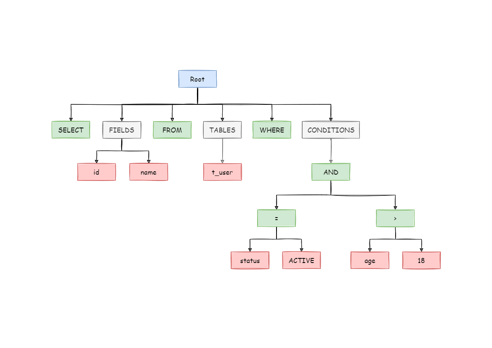

# 친절한 SQL 튜닝 (개발자를 위한 SQL 튜닝 입문서)

## 1장. SQL 처리 과정과 I/O

### SQL 파싱과 최적화

**옵티마이저 SQL 처리 과정**


**SQL 최적화 과정**
1) SQL 파싱
- 사용자로부터 SQL 을 전달받으면 SQL 파서가 파싱을 진행한다.
  - 파싱 트리 생성  - SQL 문을 이루는 개별 구성요소를 분석해서 파싱 트리 생성
  - Syntax 체크 - 문법적 오류가 없는지 확인 (ex. 사용할 수 없는 키워드, 순서, 누락된 키워드)
  - Semantic 체크 - 의미상 오류가 없는지 확인 (ex. 존재하지 않는 테이블 또는 컬럼, 오브젝트 권한)



2) SQL 최적화
- 옵티마이저는 미리 수집한 시스템 및 오브젝트 통계정보를 바탕으로 다양한 실행경로를 생성하여 비교한 후 **최저 비용의 경로** 하나를 선택한다.
- 옵티마이저는 데이터베이스 성능을 결정하는 가장 핵심적인 요소이다.

3) 로우 소스 생성
- 로우 소스 생성기는 SQL 옵티마이저가 선택한 실행 경로를 실행 가능한 코드 또는 프로시저 형태로 포맷팅 한다.

**프로시저**
- DBMS 는 쿼리를 파싱하고 최적화한 후, 이에 대응되는 내부 프로시저를 생성하여 저장한다.
  - 로우 소스 생성기가 프로시저 생성
- 프로시저는 재사용이 가능하며, 함수처럼 파라미터를 전달할 수 있다.

```mysql
CREATE PROCEDURE citycount (IN country CHAR(3), OUT cities INT)
BEGIN
  SELECT COUNT(*) INTO cities FROM world.city
  WHERE CountryCode = country;
END
```

**SQL 옵티마이저 (비용 기반 옵티마이저)**
- SQL 옵티마이저는 사용자가 원하는 작업을 가장 효율적으로 수행할 수 있는 최적의 데이터 액세스 경로를 선택해주는 DBMS 의 핵심 엔진이다.
  - SQL 쿼리 실행 시에 필요한 **디스크 블록 접근을 최소화**하기 위함
- 옵티마이저의 최적화 단계
  - 사용자로부터 전달받은 쿼리를 수행하는 데 후보군이 될만한 실행계획들 찾아냄
  - 데이터 딕셔너리에 미리 수집해 둔 오브젝트 통계 및 시스템 통계 정보를 이용해 각 실행계획의 예산비용 산정
  - 최저 비용을 나타내는 실행계획 선택
- 비용은 쿼리를 수행하는 동안 발생할 것으로 예상하는 **I/O 횟수 또는 예상 소요시간**을 표현한 값이다.
  - 비용은 옵티마이저가 여러 통계정보를 활용해 계산해 낸 값
  - 실측치가 아니므로 실제 수행할 때 발생하는 I/O 시간과는 많은 차이가 남

