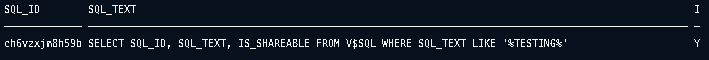

# 친절한 SQL 튜닝 (개발자를 위한 SQL 튜닝 입문서)

## 1장. SQL 처리 과정과 I/O

### SQL 공유 및 재사용

**소프트 파싱과 하드 파싱**
- SQL 파싱, 최적화, 로우 소스 생성 과정을 거치면 내부 프로시저가 생성된다.
- DBMS 는 생성된 내부 프로시저가 재사용 가능하도록 메모리 공간인 **라이브러리 캐시**에 저장한다.
- DBMS 는 사용자로부터 전달받은 SQL 을 파싱 후, 해당 SQL 이 라이브러리 캐시에 존재하는지 확인한다.
- **소프트 파싱** - SQL 이 라이브러리 캐시에 존재하여 곧바로 실행단계로 넘어간다. 
- **하드 파싱** - SQL 이 라이브러리 캐시에 존재하지 않아 최적화 및 로우 소스 생성 단계를 모두 거친다.
  - 하나의 쿼리 수행하는 데 있어 후보군이 될만한 **무수히 많은 실행경로를 도출**하고, 짧은 순간에 딕셔너리와 **통계정보를 읽어 최저 비용의 실행경로 계산** (옵티마이저)
  - 데이터베이스에서 이루어지는 처리 과정의 대부분은 I/O 작업에 집중되는 반면, **하드 파싱은 CPU 를 많이 소비**하는 몇 안 되는 작업 중 하나
  - 이러한 과정을 거쳐 생성된 내부 프로시저를 한 번만 사용하고 버린다면 비효율적일 것 

**라이브러리 캐시**
- SQL 실행과 관련된 모든 정보를 저장하고 있는 메모리 캐시 공간이다.
  - SQL 파싱이 완료되면 사용자 SQL 문이 라이브러리 캐시에 존재하는지 조회 (하드파싱 / 소프트파싱)
- SQL 텍스트와 SQL 파스 트리, 프로시저 등을 저장한다.
```oracle
// SQL 라이브러리 캐시 조회
SELECT SQL_ID, SQL_TEXT, IS_SHAREABLE FROM V$SQL WHERE SQL_TEXT LIKE '%TESTING%';
```



**이름없는 SQL 문제**
- SQL 을 처음 실행할 때 최적화 과정을 거쳐 동적으로 생성한 내부 프로시저를 라이브러리 캐시에 적재함으로써 여러 사용자가 공유하면서 재사용한다. 
- SQL 은 프로시저와 다르게 별도의 이름이 없으며, SQL 텍스트 자체가 이름 역할을 한다.
  - SQL 자체가 이름이기 때문에 텍스트 중 작은 부분이라도 변경되면 그 순간 다른 객체가 새로 탄생
  - 라이브러리 캐시에서 SQL 을 찾기 위해 사용하는 키 값이 SQL 문 그 자체
	```mysql
	// 의미적으로는 모두 같지만, 실행할 때 각각 최적화를 진행하고 라이브러리 캐시에서 별도의 공간을 사용
	SELECT * FROM emp WHERE empno = 7900;
	select * from EMP where EMPNO = 7900;
	```

**공유 가능한 SQL (바인드 변수 적용하기!)**
- 값이 달라지면 서로 다른 SQL 문이 되기 때문에 아래의 SQL 은 계속해서 하드파싱이 발생한다.
```mysql
String sqlSmt = "SELECT * FROM CUSTOMER WHERE LOGIN_ID  = '" + login_id + "'";
    
// 라이브러리 캐시
SELECT * FROM CUSTOMER WHERE LOGIN_ID = 'oraking';
SELECT * FROM CUSTOMER WHERE LOGIN_ID = 'javaking';

// 생성된 내부 프로시저
create procedure LOGIN_ORAKING() { ... }
create procedure LOGIN_JAVAKING() { ... }
```
- 바인드 변수를 적용하면 변수를 파라미터로 받는 프로시저를 공유하면서 재사용할 수 있다.
```mysql
// 바인드 변수 적용
String sqlSmt = "SELECT * FROM CUSTOMER WHERE LOGIN_ID  = ?";
    
// 라이브러리 캐시
SELECT * FROM CUSTOMER WHERE LOGIN_ID = :1
```
- 프로시저를 공유한다면 해당 SQL 에 대한 하드파싱은 최초 한 번만 일어나고, 캐싱된 SQL 을 공유하면서 재사용 가능하다.
